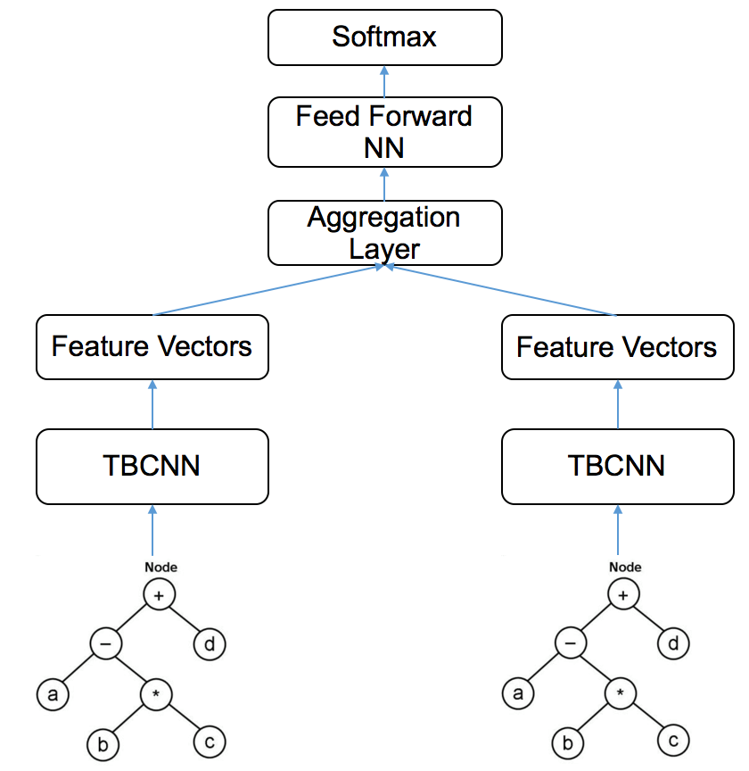

# Siamese Neural Network based on Tree-based Convolutional Neural Networks (TBCNN)

Implementation of the Siamese-TBCNN on top of TBCNN, which is the following paper:

["Convolutional Neural Networks over Tree Structures for Programming Language Processing" Lili Mou, et al.](https://arxiv.org/pdf/1409.5718.pdf)

Differences from the paper
--------------------------

* Since I found it difficult to implement the original paper to learn the pretrained vector, the pretrained vectors are learned by a variation of word2vec instead of the proposed method. The code is in this repo: https://github.com/bdqnghi/ast-node-encoding
* Adam Optimizer is used instead of gradient descent.

Current state
----------------
* Reimplemented the TBCNN paper
* The dataset used in this implementation is smaller than in the original paper (9000 programs, 6 classess compare to 52000 programs, 104 classes in the original paper). I crawled Python programs from Github by myself since using the built-in Python AST parser for Python code is more convenient and less time-consuming than writing the AST Parser for the C++ code in the original dataset, thus the node type is a little bit different.

To do list
----------------

* Building the first version of siamese neural network (SNN), each side of the SNN is a TBCNN, input of each side is the AST presentation of code in different languages. 

Illustration of the propose model : 

First time setup
----------------

This will install neccessary requirements to run this project.

    $ pip install -r requirements.txt
   

The recommended Python version is 2 because many of the scripts parsed
by the AST parser are written in Python 2.

Simply run this command to train the network, the data to train is in data/algorithm_trees.pkl, the pretrained_vectors is in data/pretrained_vectors:

    $ python train.py
    
After training, we can test the model easily by running:

    $ python test.py
    
Example output
--------------

The classification task was to classify 6 different kinds of data structures
and argorithms. The original dataset is divided 7/3 for training/testing

### After training

    ('Accuracy:', 0.9924924924924925)
                precision    recall  f1-score   support

      mergesort       1.00      1.00      1.00       413
     linkedlist       1.00      1.00      1.00       368
      quicksort       1.00      1.00      1.00       401
            bfs       0.95      1.00      0.98       313
     bubblesort       1.00      1.00      1.00       185
       knapsack       1.00      0.95      0.98       318

    avg / total       0.99      0.99      0.99      1998

    [[413   0   0   0   0   0]
     [  0 368   0   0   0   0]
     [  0   0 401   0   0   0]
     [  0   0   0 313   0   0]
     [  0   0   0   0 185   0]
     [  0   0   0  15   0 303]]

### After testing

    ('Accuracy:', 0.99300699300699302)
                precision    recall  f1-score   support

      mergesort       1.00      1.00      1.00       154
     linkedlist       1.00      1.00      1.00       157
      quicksort       1.00      1.00      1.00       166
            bfs       0.96      1.00      0.98       128
     bubblesort       1.00      1.00      1.00       109
       knapsack       1.00      0.96      0.98       144

    avg / total       0.99      0.99      0.99       858

    [[154   0   0   0   0   0]
     [  0 157   0   0   0   0]
     [  0   0 166   0   0   0]
     [  0   0   0 128   0   0]
     [  0   0   0   0 109   0]
     [  0   0   0   6   0 138]]

