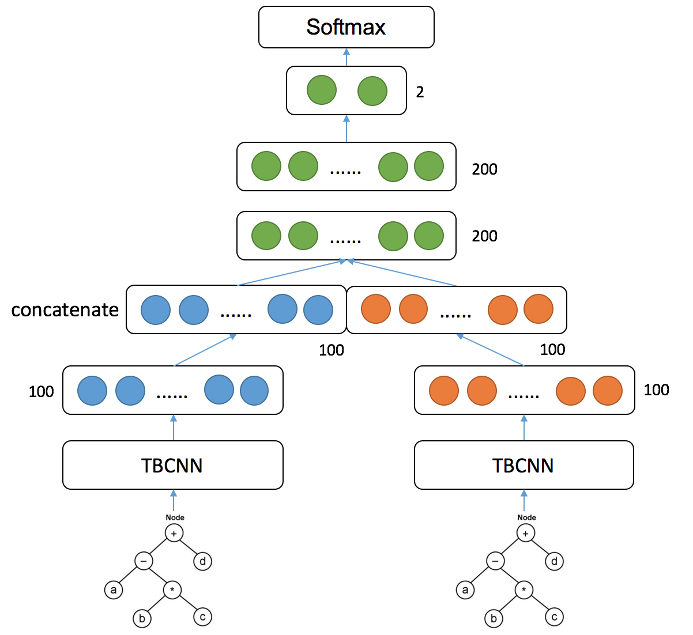
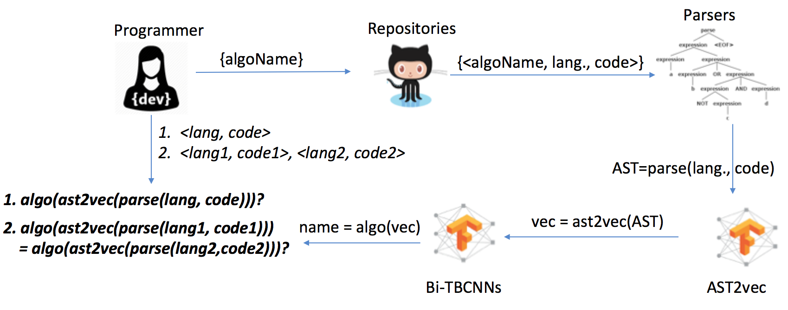

# Bilateral Neural Networks for Cross-Language Algorithm Classification

The project is the implementation of our work on the Bilateral Neural Networks introduced in our 2 papers :

- SANER'19: Bilateral Dependency Neural Networks for Cross-Language Algorithm Classification, by Nghi D. Q. BUI, Yijun YU, Lingxiao JIANG, in the 26th edition of the IEEE International Conference on Software Analysis, Evolution and Reengineering, Research Track, Zhejiang University in Hangzhou, February 24-27, 2019
- NL4SE-AAAI'18: Cross-Language Learning for Program Classification Using Bilateral Tree-Based Convolutional Neural Networks, by Nghi D. Q. BUI, Lingxiao JIANG, and Yijun YU. In the proceedings of the 32nd AAAI Conference on Artificial Intelligence (AAAI) Workshop on NLP for Software Engineering, New Orleans, Lousiana, USA, 2018. 

You can find the papers here: https://bdqnghi.github.io/publications/

Here's our proposed Neural Network structure. In short, this structure is a variance of the Bilateral Neural Network (SNN), which is  a class of Neural Network used for finding similarity or a relationship between two comparable things, which can also known as the name "Siamese Neural Network". Each sub network in this case can be:
- **Tree-based Convolutional Neural Network (TBCNN)** (https://arxiv.org/abs/1409.5718)
- **Gated Graph Neural Network** (https://arxiv.org/abs/1511.05493): the implementation of GGNN for this task can be found here: https://github.com/bdqnghi/ggnn_graph_classification
- **Dependency Tree Convolutional Neural Network (DTBCNN)** (https://bdqnghi.github.io/files/SANER_2019_bilateral_dependency.pdf)

## Installation



We have prepared a fully automated workflow (Figure 1) for you to classify programs against known algorithm names.


Figure 1. The workflow to use our tools

To do so, you need to first install docker command

```
sudo apt-get install docker-ce
```

Enter the following scripts on the command line to build and run the system respectively:
```
./r clean
```

## Modify the inputs

Insider the `input` subfolder, you will find the following files:
```
input
├── algorithm.name
├── all.algo
├── all.lang
├── config.json
├── language.name
└── srcml_node_map.tsv
```

If you just want to see how it works, we have prepared only two algorithms as follows:

### `algorithm.name`: Names of algorithms
```
bubblesort
mergesort
```

Note. You can add more algorithm names. In the NL4SE paper, we used 6 algorithms, included in the `all.algo` file. You can replace
`algorithm.name` with `all.algo`.

### `language.name`: names of programming languages
```
java .java
cpp .cpp
```
*Note* You can add more programming languages. In the NL4SE paper, we used just C++ and Java. Other programming languages are included in the `all.lang` file. You can replace `language.name` with `all.lang`.

### `config.json`: configuration of the Github API, please subsitute it with your own username and access token. 
```
{
    "GITHUB_USERNAME": "...",
    "GITHUB_ACCESS_TOKEN": "..."
}
```

### `srcml_node_map.tsv`: the syntax node types of selected programming language(s)
```
UNIT_KIND = 0
DECL = 1
DECL_STMT = 2
INIT = 3
EXPR = 4
EXPR_STMT = 5
COMMENT = 6
CALL = 7
CONTROL = 8
INCR = 9
...
STRONG = 383
OMP_OMP = 384
SPECIAL_CHARS = 385
```

*Note* that you need to make sure this file is consistent with the underlying parser.
```
$docker run -it fasttool/fast fast -v
fast v0.0.7 commit id: 3e368dd1e56f5bb8f02673b1c7441f567eab67ee with local changes id: e1b7ca5bf36050ce774cb2650446115bb49bf91ac5d889a9dbb4911ed8130225
built with 6.4.0 on Nov 14 2017 at 20:00:04
```

If a different version of `fast` is prepared, it might require a regenerated input file `./ast2vec/ast2vec/fast_pb2.py` if there is any change in the language grammar. 

### Other parameters for tensorflow framework are stored in the following two files, each corresponds to a Tensorflow run.
```
./ast2vec/ast2vec/parameters.py
./bi-tbcnn/bi-tbcnn/parameters.py
```

## References
```
@inproceedings{DBLP:conf/aaai/BuiJY18,
  author    = {Nghi D. Q. Bui and
               Lingxiao Jiang and
               Yijun Yu},
  title     = {Cross-Language Learning for Program Classification Using Bilateral
               Tree-Based Convolutional Neural Networks},
  booktitle = {The Workshops of the The Thirty-Second {AAAI} Conference on Artificial
               Intelligence, New Orleans, Louisiana, USA, February 2-7, 2018.},
  pages     = {758--761},
  year      = {2018},
  crossref  = {DBLP:conf/aaai/2018w},
  url       = {https://aaai.org/ocs/index.php/WS/AAAIW18/paper/view/17338},
  timestamp = {Thu, 19 Jul 2018 13:38:55 +0200},
  biburl    = {https://dblp.org/rec/bib/conf/aaai/BuiJY18},
  bibsource = {dblp computer science bibliography, https://dblp.org}
}

@INPROCEEDINGS{8667995, 
    author={B. {Nghi D. Q.} and Y. {Yu} and L. {Jiang}}, 
    booktitle={2019 IEEE 26th International Conference on Software Analysis, Evolution and Reengineering (SANER)}, 
    title={Bilateral Dependency Neural Networks for Cross-Language Algorithm Classification}, 
    year={2019}, 
    volume={}, 
    number={}, 
    pages={422-433}, 
    keywords={Neural networks;Prediction algorithms;Classification algorithms;Syntactics;Semantics;Machine learning algorithms;Task analysis;cross-language mapping;program classification;algorithm classification;code embedding;code dependency;neural network;bilateral neural network}, 
    doi={10.1109/SANER.2019.8667995}, 
    ISSN={1534-5351}, 
    month={Feb},
}

```
