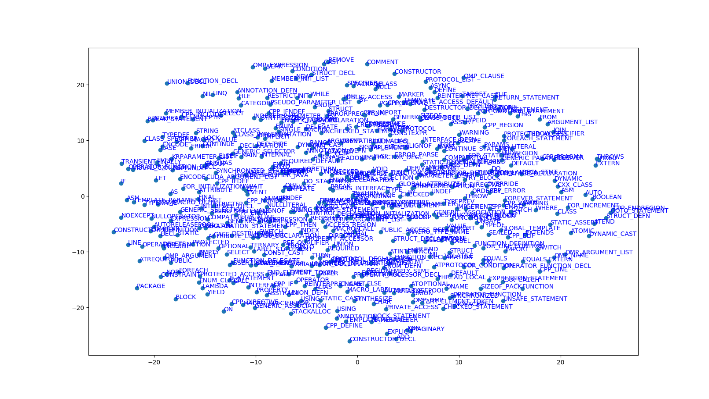

# Encoding the AST Tree using a strategy similar to word2vec, but applied to the context of AST's

This works is an attempt to learn vector representation for AST nodes. The original paper is: https://arxiv.org/abs/1409.3358 Since this paper is difficult to understand and implement, we applied the strategy similar to word2vec to learned embeddings of AST nodes. 

* Vectors are learned by a variation of word2vec instead of the proposed method.
* Adam is used instead of gradient descent.
* The dataset used in this implementation is the same as the original paper. The AST Parser for the C++ code is based on [srcML](http://srcml.org),
which is further translated into protobuf structures using [fast](https://github.com/f-ast/fast), and converted into the AST in the pickle format. 
The differences between the ASTs and python's own AST is in the node_map. There are 450 types of nodes in the srcML ASTs, as opposed to 95 types of
python.

The list of learned token vectors can be found here:
https://github.com/bdqnghi/siamese-tbcnn/blob/master/data/fast_pretrained_vectors.txt

End-to-end instruction to train AST vectors:
----------------
* 
* Go to ```data/ProgramData```, execute:
    
    ```bash
    fast 1/1.c 1/1.pb
    fast 1/1.pb 1/1.pkl 
    ```
  to obtain the pickle AST. 
* When these are obtained for all the C source code, execute
    ```python
    python fast-node-encoding/fast_merge_pickles_to_pickle.py data/ProgramData data/algorithms3.pkl
    ```
    This step is to merge the converted individual pikle ASTs into a single pickle file, which can be found in ```data/algorithms3.pkl```. 
    The pickle is nothing but just a list of ast trees with label, an example tree in the list is like:
  ```
  {'tree': <_ast.Module object at 0x7f84c52f9210>, 'metadata': {'label': 'mergesort'}}
  ```
    **Note that this is not the format we're going to use to train the TBCNN, this step is just to store data for some archive purpose instead of reloading the heavy raw data all the time.The format we'll use to train the TBCNN is in ```data/algorithm3_trees.pkl```**
 
* Execute:
    
    ```python
    python fast-node-encoding/fast_pickle_file_to_nodes.py data/algorithms3.pkl data/algorithms_nodes3.pkl
    ```
  This step is to convert the ASTs in pickle file into a list of nodes, each node will have the following format:
  
  ```
  {'node': 'Module', 'children': ['FunctionDef', 'FunctionDef', 'FunctionDef', 'Print'], 'parent': None}
  
  {'node': 'arguments', 'children': ['Name'], 'parent': 'FunctionDef'}
  ```
  After executing the script, we can find the pickle to store all the nodes in ```data/algorithm_nodes3.pkl```.

* Once we get the ```algorithm_nodes3.pkl```, execute:

  ```python
    python fast-node-encoding/fast_train.py data/algorithms_nodes3.pkl data/fast_pretrained_vectors.pkl
    ```
  The main() function in this file will open the ```data/algorithm_nodes3.pkl``` and output the pickle ```fast_pretrained_vectors.pkl``` into the data directory.
  
In short, the steps are: 
```
convert raw data to algorithms3.pkl --> convert algorithms3.pkl to algorithm_nodes3.pkl --> use the algorithm_nodes3.pkl to train and output fast_pretrained_vectors.pkl
```
A visualization of learned token
--------------------------

